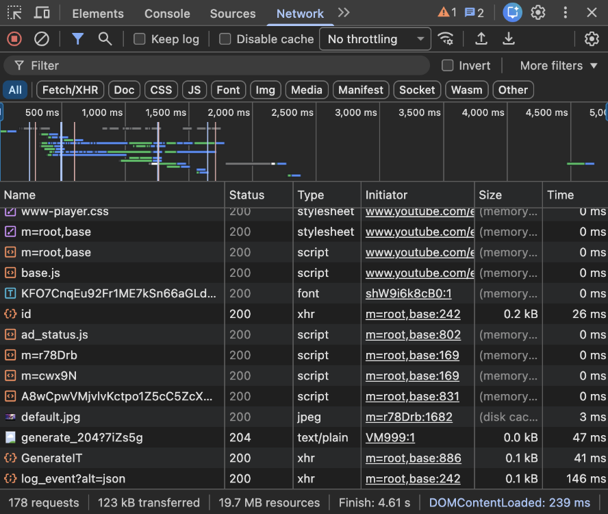

## Inspecting the website - Spider-Man: Across the Spider-Verse

[https://www.sonypictures.com/movies/spidermanacrossthespiderverse?](https://www.sonypictures.com/movies/spidermanacrossthespiderverse?)

I looked at the Sony Pictures page for the Spider-Man: Across the Spider-Verse movie, and inspected it using the Chrome Developer Tools. I took a look at the Network tab, and I found HTML, CSS, and JavaScript files, so the site uses all three of these main web technologies. There were also some more image files for example JPG, PNG, SVG, and also JSON files and WOFF2 (font files). I think the page was using JavaScript for some of its interactive features because it showed up a lot.

## Who Built the Website?

The website is from and is run by Sony Pictures Entertainment and it is part of the official Sony Pictures Website. There was not much I could find, but I believe Sony has its own digital teams that work on the movie websites and online content. There was no public list showing exactly who and how many people worked on this page, so I don’t think I have an exact number. I would estimate multiple people rather than just one though, because it is a large studio.

## Screenshot

